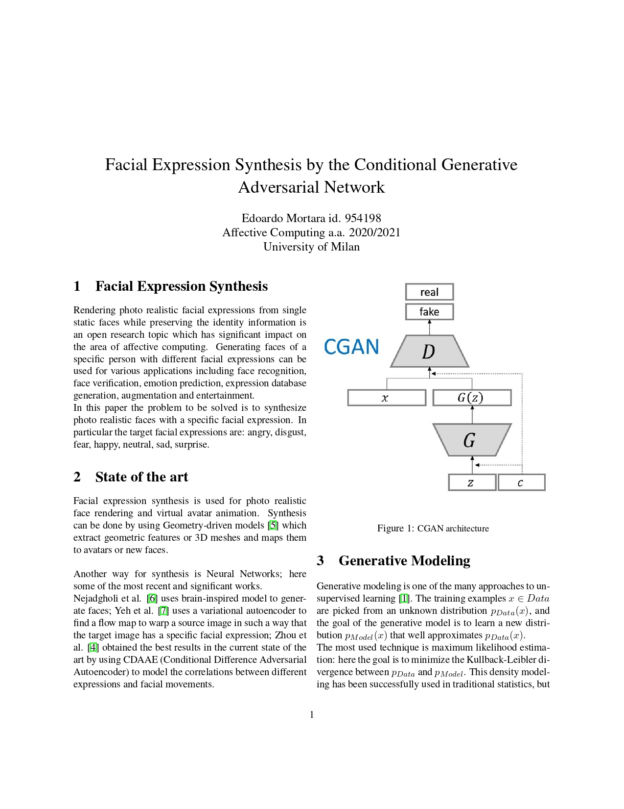
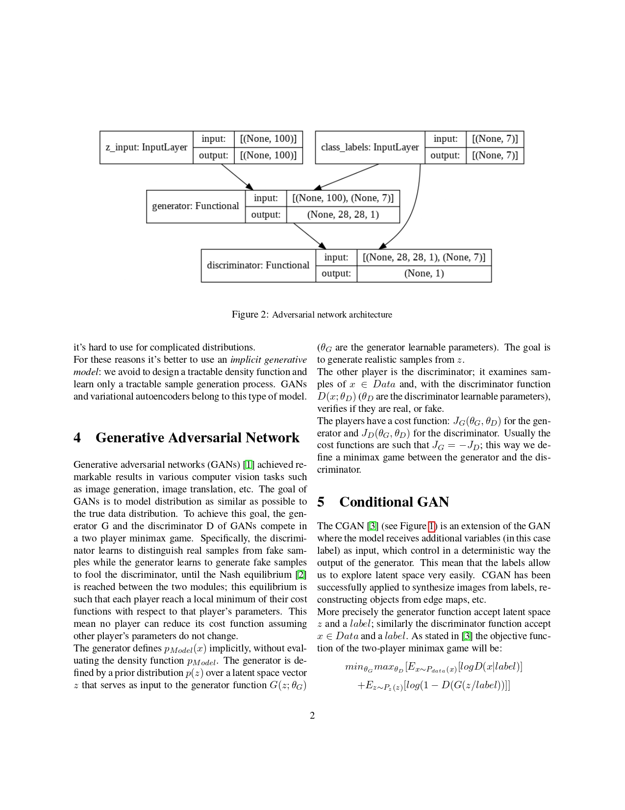
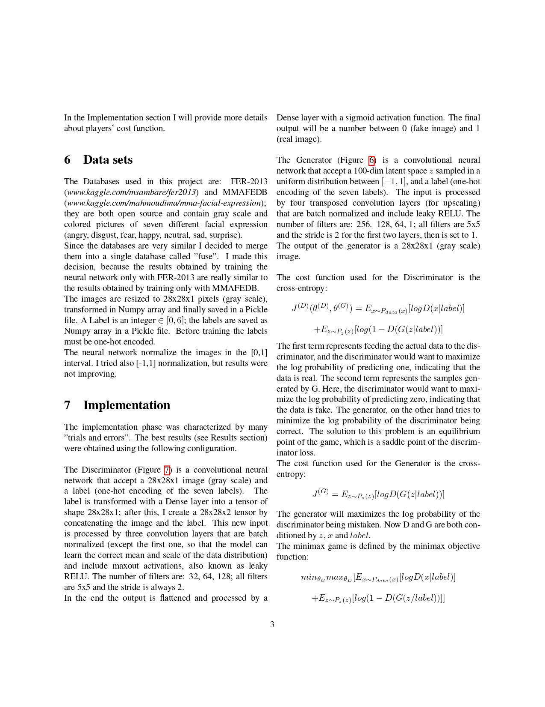
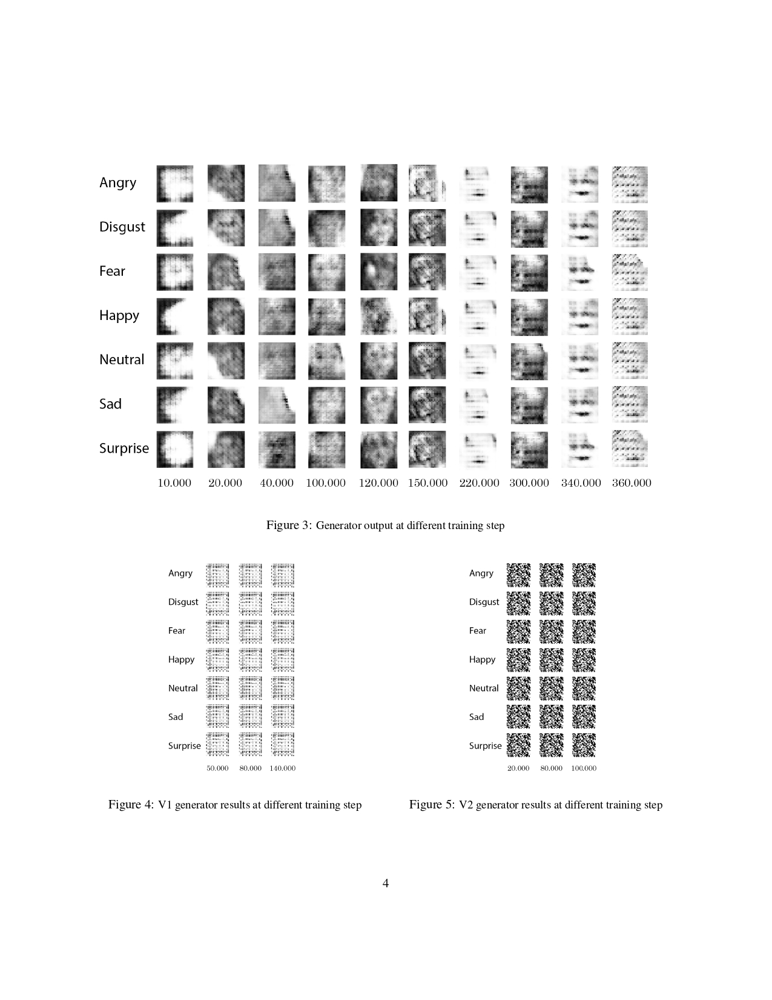
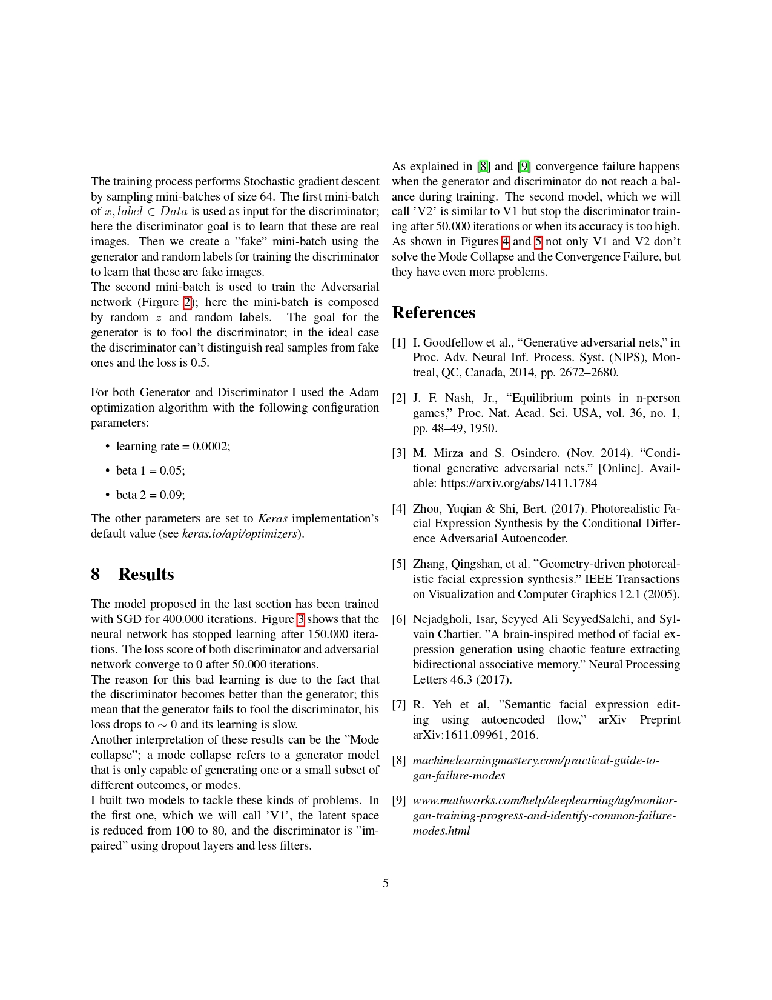
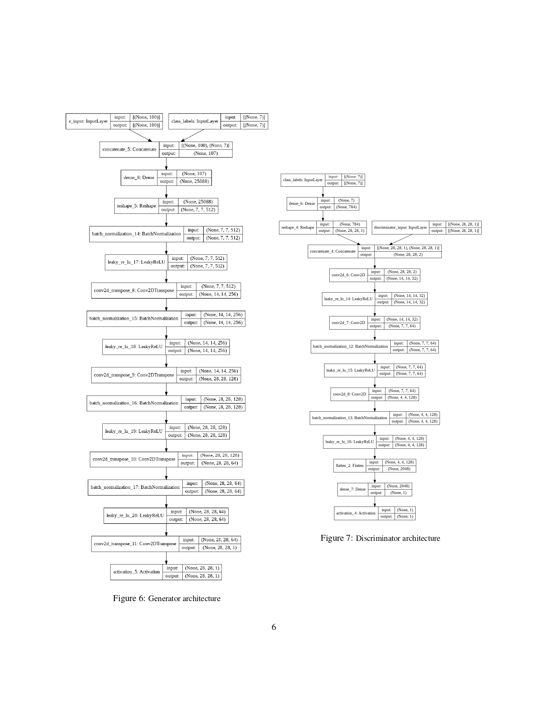

# Facial Expression Synthesis by the Conditional Generative Adversarial Network

## Author: Edoardo Mortara, University of Milan

## Introduction

Rendering photo realistic facial expressions from single
static faces while preserving the identity information is
an open research topic which has significant impact on
the area of affective computing. Generating faces of a
specific person with different facial expressions can be
used for various applications including face recognition,
face verification, emotion prediction, expression database
generation, augmentation and entertainment.
In this paper the problem to be solved is to synthesize
photo realistic faces with a specific facial expression. In
particular the target facial expressions are: angry, disgust,
fear, happy, neutral, sad, surprise.

